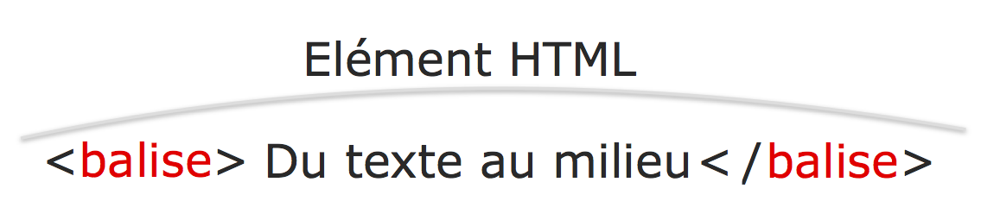

# Intro:


## Qu'est ce concretement qu'un projet web + présentation de Sublime


La première chose qu'il faut comprndre, c'est qu'un projet web, comme tout projet informatique, quelque soit leur compléxité n'est rien d'autre qu'une arborescence de fichiers ne contenant que du texte brut.

Coder, ce n'est qu'ecrire. Aussi le premier outil du développeur, c'est l'éditeur de texte.

<<<<<<<<<<<<<<<<<<<<<<<<<<<<<
*ajouter bref description de sublime et pourquoi c'est mieux qun editeur de base*
<<<<<<<<<<<<<<<<<<<<<<<<<<<<<

Du coup, regardons a quoi peut ressembler un projet web basique
Prenez par exemple ce dossier monPremierProjet, qui contient des sous dossiers et des fichiers. Je l'ouvre dans Sublime Texte
Là vous voyez à gauche, on retrouve l'arborescence du dossier qu'on a ouvert.
On observe que certains noms de fichiers terminent par .html, d'autre par .js, d'autre encore par .css, mais tous sont des fichiers de texte. ces lettres a la fin du nom, c'est ce qu'on appelle l'extension, et c'est ce qui va dire a l'ordinateur comment il doit interpreté les caractères qui sont dans ces fichiers.


Chaque langge a sa propre syntaxe et tous ses fichiers communiquent entre eux, s'appliquent les uns au autres selon des regles que nous allons voir tres vite.

<<<<<<<<<<<<<<<<<<<<<<<<<<<<<
*trouver une transition*
<<<<<<<<<<<<<<<<<<<<<<<<<<<<<


## HTML, CSS et JS, les 3 pilliers du web

Les 3 langages fondamentaux du web sont HTML, CSS et JS. HTML est la première brique qui a été posée lors de la création du web, c'est la base de tout site web.
Voila a quoi ressemblait le web en 1991:


Vous voyez, c'est laid, mais il y a déja une structure: on peut distinguer des titres, des listes, des paragraphes, et meme des éléments plus complexes comme des liens, des images et des tableaux. C'est cette structure qu'HTML apporte par rapport a du contenu brut qui serait comme ceci:


En 1996, on a inventé le CSS, conçu pour habiller les pages web ecrites en HTML. CSS, c'est un peu le maquillage du web. C'est grace à lui par exemple que l'on dit que tel paragraphe sera en rouge sur fonds gris, que tel bouton aura des angles arrondis ou que tel élément sera placé à droite de la page.

Avec HTML et CSS, vous avez les composants de base de tout site web aujourd'hui, mais un troisième langage est devenu essentiel aujourd'hui, c'est le javascript. Le JS, c'est le langage qui donne vie à vos pages web en les rendant intéractives.
Par exemple, c'est grace à lui qu'on crée un bouton "dropdown"


ou bien l'effet d'une navbar (la barre de navigation qui se situe généralement en haut d'une page web) qui disparait quand on scroll


Vous voyez donc que le developpement web, comme d'ailleurs le code en général, n'est pas le résultat d'un langage unique mais bien une superposition de langages qui interagissent entre eux.

Pour terminer sur un exemple, voyez facebook:


il y a manifestement du HTML, puisqu'on a des titres, des liens, des images...
du CSS: puisque le fond est bleu, qu'on a une section a droite, une section a gauche, que toutes les images sont arrangées correctement, ont la bonne taille...
et du Javascript qui par exemple est derriere les 3 boutons classiques de FB (amis, notif, messages)

Voila a quoi ressemble FB si l'on désactive le JS:


puis si l'on désactive le CSS et qu'il ne reste que du pur HTML


Si enfin on avait pas le HTML, ce ne serait que du texte sans forme comme ceci:


Nous allons bientot rentrer au coeur du sujet en plonger dans chacun de ces 3 langages, mais d'abord nous allons introduire le premier outil du développeur, qui nous sera necessaire pour les exercices et les exemples: l'éditeur de texte.


# 1° HTML basics: Hypertext Markup Language
## Syntaxe

Arretons nous une minute sur la définition de l'acronyme. D'abord Hypertexte: Ce mot etrange, consciemment ou non, vous l'avez tous déja rencontré. Vous savez tous ce qu'est un lien sur le web: un bouton permettant de naviguer depuis une page vers une autre. Eh bien le nom complet de cet objet est en fait "lien hypertexte". Ce mot dans l'acronyme HTML fait référence au système permettant de connecter des pages web entre elles.
Et maintenant, le mot qui nous intéresse le plus ici, c'est Markup. Dans ce contexte, le markup, c'est le fait d'annoter, d'augmenter, de mettre en forme du contenu, et c'est exactement ce que fait HTML. Rappelez vous la différence entre une page HTML et du contenu brut


HTML est un langage tres simple. En quelques minutes, nous allons voir comment il fonctionne

Il y a 3 composants en HTML: les éléments, les balises et les attributs

Un élément, c'est simplement du contenu à l'intérieur de 2 balises



Commencons a introduire quelques balises courantes pour avoir des exemples concrets

`<h1></h1>`, `<h2></h2>`... jusqu'à `<h6></h6>`
`<strong></strong>`
`<ol></ol>` pour "ordered list" et et `<li></li>` pour "list item", qui sont les éléments dans cette liste

Ces exemples nous permettent d'illustrer un point fondamental, c'est que les éléments html s'imbriquent les un dans les autres au sein d'elements plus grands.

```html
<h2>How to become <strong>very</strong> good at coding</h2>

<ol>
  <li>learn HTML</li>
  <li>learn CSS</li>
  <li>learn Javascript</li>
</ol>
```

Remarquez aussi la syntaxe utilisée: tous les éléments sont constitués de contenu ensérré dans 2 balises de meme type, avec une balise ouvrante: `<balise>` et une balise de fin, qui a juste un slash entre le premier chevron et le nom de la balise: `</balise>`

Cette syntaxe du langage HTML peut le rendre difficle a lire et a comprendre, et c'est pourquoi il est tres important d'indenter son code. L'indentation, c'est le décallage d'une ligne par rapport à la marge. En HTML, ca n'influe pas sur la validité du code, mais cela donne un apercu visuel de l'imbrication des différents elements les uns dans les autres.
Comme ici:
```html
<ol>
  <li>learn HTML</li>
  <li>learn CSS</li>
  <li>learn Javascript</li>
</ol>
```

C'est encore plus important quand le code se complexifie, notamment avec des elements répétés comme les div, des éléments.

<<<<<<<<<<<<<<<
*en profiter pour présenter les div*
<<<<<<<<<<<<<<<


J'insiste, prenez l'habitude d'indenter votre code, c'est tres important!

Enfin, le troisième composant en HTML, qui est aussi fondamental, c'est les **attributs**
Les attribut caractérisent ou modifient les éléments auquels ils se rattachent. Par exemple, l'élément <a></a> sert à insérer des liens dans une page web. Mais bien sur un lien ne sert à rien si l'on ne dit pas vers quelle page il doit renvoyer. On fait cela avec l'attribut *href=* (hyperlink reference).

`<a href="http://www.eclore.co">Ceci est un lien vers Eclore!</a>`

Dans cet exemple, le texte a l'intérieur de la balise est celui qui s'affiche pour l'utilisateur.
J'en profite pour mentionner 2 attributs clé, *class=* et *id=*qui servent notamment a appliquer des regles de style css a des éléments particuliers.
par exemple, si j'ai
```html
<h1 id="main-title"></h1>
<h1 class="subtitle"></h1>
```
je vais pouvoir formatter différement ces 2 titres. Nous verront cela bientot quand nous attaquerons le CSS

Il existe plein d'attributs possibles, et tous suivent la meme syntaxe: ils s'ecrivent dans la balise d'ouverture, sont suivis d'un signe "=" et de leur valeur entre des guillements
```html
<h1 class="title">Quel joli titre</h1>
<ul id="sommaire">
  <li>liste à un seul élément</li>
</ul>

```
Un élément HTML peut avoir autant d'attributs que nécessaire et ils peuvent être placés dans n'importe quel ordre. Nous verrons bientot

## la page HTML

Une page web suit toujours la même armature obligatoire:
```html
<!DOCTYPE html>
<html>
  <head>
    <meta charset="utf-8">
    <title>Eclore</title>
  </head>
  <body>
  </body>
</html>
```
Examinons ces éléments un à un:

`<!DOCTYPE html>` cette balise indique simplement à votre navigateur qu'il s'agit d'une page HTML, pour qu'il l'interprete comme tel. Remarquez qu'il n'y a pas de balise de fin. Cette balise est un exemple de *self-closing tag*. Il existes quelques autres balises comme celle ci, la plus connue et utilisée étant la balise d'image `` que nous verrons bientot.

Ensuite l'ensemble du document est placé entre 2 balises `<html></html>` et comporte 2 sous-parties: `<head></head>` et `<body></body>`

Pour faire simple, le "head", c'est a dire en quelque sorte l'en-tête du document et il contient des éléments de configuration et le "body", c'est l'endroit où l'on met le contenu de la page qui va s'afficher pour les utilisateurs. D'une manière générale, à une grosse exception pret, que nous verront plus tard, si un élément peut aller dans le body, il ne peut pas aller dans le head, et vice versa. Par exemple, une balise `<ul></ul>` ou une image (``) ne peuvent aller que dans le body, mais la balise title, qui détermine le titre de votre page, qui s'affiche ici (``) ne peut aller que dans le head.

Avant de s'aventurer plus loin dans ces explications, il est important de faire une introduction au CSS

# 2° Introduction au CSS


Au début d'internet HTML était la pour donner du sens à votre contenu: « ceci
est ma barre de navigation, ceci est mon titre, ceci est une liste».
CSS est là pour dire: "ma barre de navigation a un fond noir ou mes boutons sont bleus". C'est donc grâce au CSS que vous pouvez faire le design de votre site. Voyons comment.

Tout d'abord, où met-on le CSS? Ceux d'entre vous qui ont déja un peu de connaissances du code savent peut etre qu'il y à 3 manières de le faire. Cependant, d'un point de vue pratique et opérationnel, seule une est valable et effectivement utilisée par les développeurs. Elle consiste à séparer mettre le CSS dans un fichier séparé du HTML. D'où les fichiers .html et .css quer nous vous avons montré dans l'introduction

On a donc un projet web avec plusieurs fichiers: des fichiers html pour le contenu et des fichiers css pour la présentation et le design de ce contenu.


<<<<<<<<<<<<<<<<<<<<
*montrer à cet endroit la si ca n'a pas déja été fait commnt on lie les fichiers css au fichiers html*
<<<<<<<<<<<<<<<<<<<


La syntaxe des fichers css est extremement simple, il y a 3 éléments importants: les selecteurs, les propriété, et leur valeur. Ils suivent la syntaxe suivante:
```css
selecteur {
  propriété1: valeur1;
  proprété2: valeur2;
}
```

Le fichier CSS, on l'a dit, est votre trousse de maquillage. Filons cette métaphore.

Le sélecteur est la partie de votre corps sur laquelle on applique ce maquillage. La propriété définit le type de maquillage (rouge à lèvres, fard a paupières) et chaque type de maquillage peut avoir différentes valeurs: un rouge à lèvres peut être rouge ou rose, un mascara waterproof, effet volume, ...

analysons un exemple concret:
le selecteur h1 indique que le style va s'appliquer a tous les éléments H1, puis 3 propriétés de style sont énoncées entre les accolades
```css
h1 {
  font-weight: bold;
  font-size: 22px;
  color: red;
}
```
Remarquez qu'ici nous avons utilisé comme selecteur un type de balise HTML: H1. Du coup les styles que l'on a défini entre les accolades vont s'appliquer a TOUS LES ELEMENTS H1 de la page Html! De la meme manière on aurait pu utiliser ul, li, h3, div... n'importe quelle balise Html peut etre utilisée comme selecteur.
Mais comment faire lorsqu'on veut appliquer un style seulement à certains titres h1, et pas tous, ou à certaines div, et pas toutes?
Dans ces cas là on a recours à 2 outils clés dont nous avons déja parlé, les class et les ID

## class et id: la clé des sélécteurs CSS

class et id sont des attributs essentiels des éléments html.
Admettons qu'on ait un titre `<h1>Quel joli titre</h1>`
Pour lui donner une classe ou une id il suffit d'ecrire `<h1 class="example-class">Quel joli titre</h1>` ou `<h1 id="example-id">Quel joli titre</h1>`

Un élément html peut avoir une classe, une id, ou les 2. On peut lui donner n'importe quelle chaine de caractères pour id ou class. A noter qu'un meme objet peut avoir plusieurs classes, simplement séparées par des espaces:
`class="class1 class2 class3"` mais ne peut avoir qu'une id. De même, plusieurs éléments html sur une même page peuvent avoir les mêmes classes, mais si plusieurs éléments sur la même page ont la même id, cela peut créer des problèmes.

Alors quel rapport avec les selecteurs css? Eh bien de la meme manière que l'on peut appliquer un style css a tous les éléments html de même type, on peut appliquer un style à tous les elements partageant une même class ou bien à un élément ayant une id particulière.

Pour appliquer un style à une classe, il suffit d'ecrire comme selecteur le nom de la class précédé d'un point `.`
par exemple
```css
.main-title {
  font-weight: bold;
  font-size: 22px;
  color: red;
}
```
et pour appliquer un style a un id dans le fichier css, il suffit de précéder le nom de l'id précédé d'un `#`
```css
  #signup-button {
    background-color: white;
  }
```


###Fiche memo: les principales balises HTML


